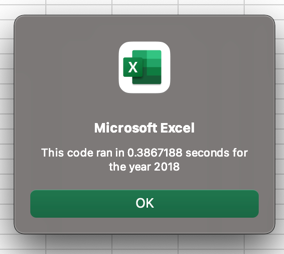
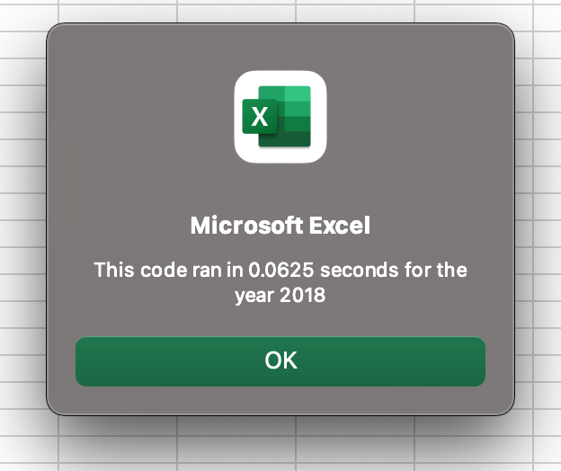

# stock-analysis

## Overview of Project & Purpose

The purpose of this project was two-fold. First there was a functional purpose in teaching a more advanced use of index(s) and array(s) in order to store data and move through lists quicker. The second purpose was to demonstrate that code can be written in many different fashions to accomplish the same objective. Did the original subroutine accomplish the goals of the analysis? Absolutely. However by applying different commands and thinking about the way we are not only analyzing but storying the data we are working on, we can see vast improvements in efficiencies. 

## Results

As mentioned above, the original subroutine accomplished the goal of scanning the stock data for a given year and outputting formatted results. According to timer testing this original macro was able to scan the 2018 data in 0.3867188 seconds. While this is a short amount of time, this is also a small data set. If we were to examine more data points, or a larger list of ticker symbols this code could take a long amount of time to complete. 

During the refactoring of the code we were able to restructure how the entire process of analyzing the data was handled. In the original subroutine we went through individual ticker symbols one by one while also scanning the data line by line in order to find matches and add their trading volume to the total. By analyzing an array in the refactoring we are able to have our code scan each line of the data only once. During that singular check of the line of stock data we are able to not only add that lines trading volume to an arraym regardless of the ticker symbol, but we are also able to run nested if statements that will check that individual line of data to identify if it is a starting or ending value and add it to the appropriate array, linked to it's ticker symbol if so. 

This process allows us to scan each row of data only once while obtaining all the information we need. Originally our code did work but it required scanning all 3,000+ lines of code for every ticker symbol. That means that we were looking at the same data 13 times instead of once. The difference is seen in the timer results. 

The below image shows our original run time for data from 2018 
 = 150 x 150 

Now with the refactored code we are able to see that our runtime has improved almost 5x. 
 

### Summary

Analysis of theatre projects launched indicates that May is the most succesful month, with June and July following suit. The least successful funding time for the campaigns falls in November and December, there is a potential correlation here with the holiday and lower spending on crowdfunding by donors. 

