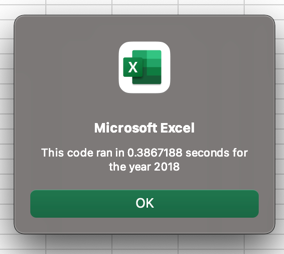
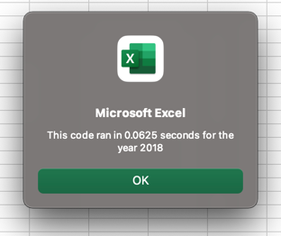

# stock-analysis

## Overview of Project & Purpose

The purpose of this project was two-fold. First there was a functional purpose in teaching a more advanced use of index(s) and array(s) in order to store data and move through lists quicker. The second purpose was to demonstrate that code can be written in many different fashions to accomplish the same objective. Did the original subroutine accomplish the goals of the analysis? Absolutely. However by applying different commands and thinking about the way we are not only analyzing but storing the data we are working on, we can see vast improvements in efficiencies. 

## Results

As mentioned above, the original subroutine accomplished the goal of scanning the stock data for a given year and outputting formatted results. According to timer testing this original macro was able to scan the 2018 data in 0.3867188 seconds. While this is a short amount of time, this is also a small data set. If we were to examine more data points, or a larger list of ticker symbols this code could take a long amount of time to complete. 

During the refactoring of the code we were able to restructure how the entire process of analyzing the data was handled. In the original subroutine we went through individual ticker symbols one by one while also scanning the data line by line in order to find matches and add their trading volume to the total. The below snippet shows just a portion of the original subroutine which looked explicitely for the selected ticker symbol and moved on if it was not found. 
 
                If Cells(j, 1).Value = ticker Then

                    'increase totalVolume by the value in the current row
                    totalVolume = totalVolume + Cells(j, 8).Value

                End If

By analyzing an array in the refactoring we are able to have our code scan each line of the data only once. During that singular check of the line of stock data we are able to not only add that lines trading volume to an arraym regardless of the ticker symbol, but we are also able to run nested if statements that will check that individual line of data to identify if it is a starting or ending value and add it to the appropriate array, linked to it's ticker symbol if so. The code from above has been updated to reflect this change in approach. 

     '3a) Increase volume for current ticker
                tickerVolumes(tickerIndex) = tickerVolumes(tickerIndex) + Cells(i, 8).Value

This process allows us to scan each row of data only once while obtaining all the information we need. Originally our code did work but it required scanning all 3,000+ lines of code for every ticker symbol. That means that we were looking at the same data 13 times instead of once. The difference is seen in the timer results. 

The below image shows our original run time for data from 2018 

Now with the refactored code we are able to see that our runtime has improved over 6x, down to 0.0625 seconds. 

 

### Summary

- What are the advantages or disadvantages of refactoring code?
There are several advantages to refactoring code. The first of which is that it allows us to apply new concepts we may not have known or understood when the code was first written. Additionally it allows us to view our code with fresh eyes. Even if we have learned no new concepts in coding since we wrote the original code, odds are that we have additional experience or approaches in thinking that can be applied. It also allows us to to utilize the feedback we have from using the code. Sometimes we may write code that is perfectly acceptable for the process it was intended for, but as the process grows so does the scope, especially if the code is useful. Refactoring existing code allows us to add functionality that did not exist before. In the instance of this challenge, our original version of the code was limited to a single ticker symbol, that grew to a range or ticker symbols, and then to faster analysis, timers, year selections, and even a button to make it easy for the end user. As the use case changes, the code needs to be refactored to keep up. 

The disadvantages can be a lack of understanding of the original code if we were not the writers, or if it was poorly commented by ourselves or others. Additionally, some key concepts can be tied into large portions of the code that require a lot of rewriting to implement. 

- How do these pros and cons apply to refactoring the original VBA script?
As mentioned above, our original code was written to hardcode looking for a specific ticker symbol. Once we moved to an array of ticker symbols and a different approach to looking at the data, we effectively had to rewrite the entire codebase. While some of the concepts and the formatting were carried over, the key logic had to be almost entirely rebuiilt. Depending on the complexity of the code this could be a large lift, luckily in this VBA subroutine it was not. 

From a pros side in this projcet, we have added a large amount of functionality with a relatively small refactoring. Our performance improved substantually, and the user experience was made much better. 

